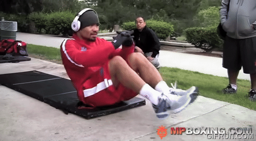
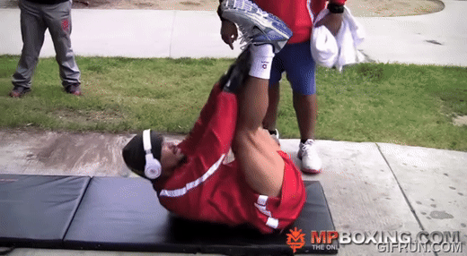
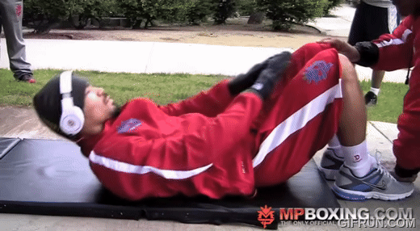
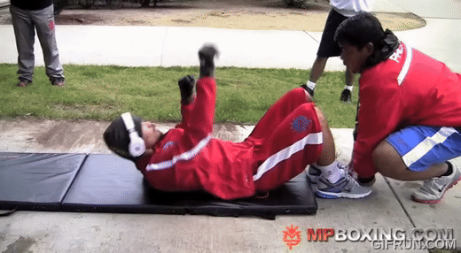
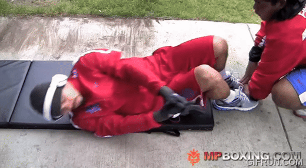
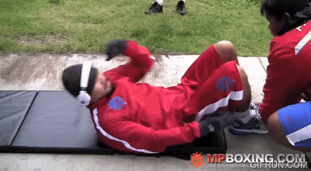
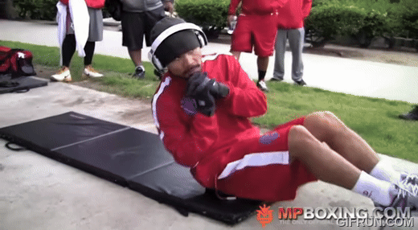

# Best Abs Routine of All Time

## 1. Overview

[Manny Pacquiao](https://en.wikipedia.org/wiki/Manny_Pacquiao) is widely considered one
of the best (if not the best) boxers of all time. 

As such, this can only be none other than one of the best (if not the best) abs routine of all time.

<!-- more -->

GIFs extracted from [video routine uploaded by mannypacquiaofficial][1].

Exercise transcriptions adapted from [Muddy's transcription][2].

## 2. The Routine

#### 2.1. FLUTTER KICKS: Sit up position, feet up and down (tip toes), with hands over knees.

#### 2.2. SCISSORS: Sit up position, Cross over’s (feet over each other)

#### 2.3. Sit up position, ½ Leg press, feet off ground (forward)

#### 2.4. AB PULSES: Lie flat, cross legs and push legs to body

#### 2.5. VERTICAL TOE TOUCHES: Lie flat, legs vertical, knees slightly bent touch shoe laces

#### 2.6. Lie flat, crunches to knees

#### 2.7. Lie flat, hand catches to sky (one each side, right and left)

#### 2.8. Lie flat, sit up position, rotate body (keep legs normal), and crunch ‘handshake’ crunch to left side

#### 2.9. Lie flat, sit up position, rotate body (keep legs normal), and crunch ‘handshake’ crunch to middle side

#### 2.10. Lie flat, sit up position, rotate body (keep legs normal), and crunch ‘handshake’ crunch to right side

#### 2.11. CRUNCH ANTICLOCKWISE: Lie flat, Abs rotation 

#### 2.12. CRUNCH CLOCKWISE: Lie flat, Abs rotation 

#### 2.13. Lie flat, crunch elbow to opposite right knee

#### 2.14. Lie flat, crunch elbow to opposite left knee

#### 2.15. HEEL FLICKS: Lie flat, heel touches to right

#### 2.16. HEEL FLICKS: Lie flat, heel touches to left

#### 2.17. Lie on side, side crunches to right

#### 2.18. Lie on side, side crunches to left

#### 2.19. Sit up position, feet off floor prayer twist crunch to right

#### 2.20. Sit up position, feet off floor prayer twist crunch to left

#### 2.21. RUSSIAN TWIST CRUNCH: Sit up position, leg press crunch forward, hands behind buttocks

#### 2.22. Rethink why did you start this routine

[1]: https://www.youtube.com/watch?v=0JN8Nque1Sc "Original Video from mannypacquiaofficial"

[2]: https://www.docdroid.net/UzoYYd9/manny-pacquiao-abs-workout-doc "Muddy Workout Transcription"