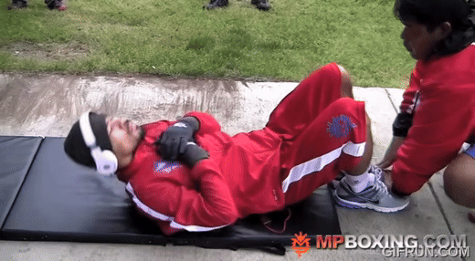

# Manny Abs Routine

[Manny Pacquiao](https://en.wikipedia.org/wiki/Manny_Pacquiao) is widely considered one
of the best (if not the best) boxers of all time. 

As such, this can only be none other than the best (if not the best) abs routine of all time.

Exercises taken from [Muddy's transcription][1].

FLUTTER KICKS: Sit up position, feet up and down (tip toes), with hands over knees.

SCISSORS: Sit up position, Cross over’s (feet over each other)

Sit up position, ½ Leg press, feet off ground (forward)

AB PULSES: Lie flat, cross legs and push legs to body

VERTICAL TOE TOUCHES: Lie flat, legs vertical, knees slightly bent touch shoe laces

Lie flat, crunches to knees

Lie flat, hand catches to sky (one each side, right and left)

Lie flat, sit up position, rotate body (keep legs normal), and crunch ‘handshake’
crunch to left side

Lie flat, sit up position, rotate body (keep legs normal), and crunch ‘handshake’
crunch to middle side

Lie flat, sit up position, rotate body (keep legs normal), and crunch ‘handshake’
crunch to right side

CRUNCH ANTICLOCKWISE: Lie flat, Abs rotation 

CRUNCH CLOCKWISE: Lie flat, Abs rotation 

Lie flat, crunch elbow to opposite right knee

![Too bad no footage]
Lie flat, crunch elbow to opposite left knee

HEEL FLICKS: Lie flat, heel touches to right

HEEL FLICKS: Lie flat, heel touches to left

Lie on side, side crunches to right

Lie on side, side crunches to left

Sit up position, feet off floor prayer twist crunch to right

Sit up position, feet off floor prayer twist crunch to left

RUSSIAN TWIST CRUNCH: Sit up position, leg press crunch forward, hands behind buttocks

Rethink why did you start this.

[1]: https://www.docdroid.net/UzoYYd9/manny-pacquiao-abs-workout-doc "Muddy Workout Transcription"